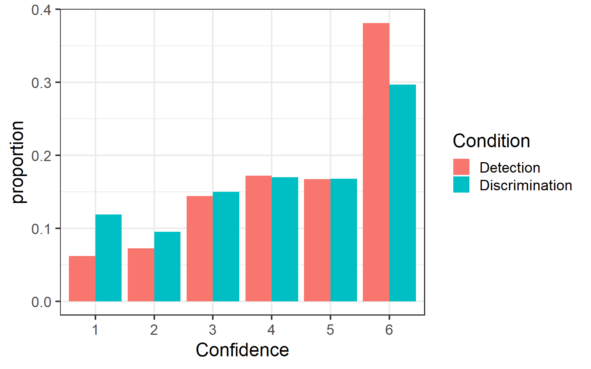
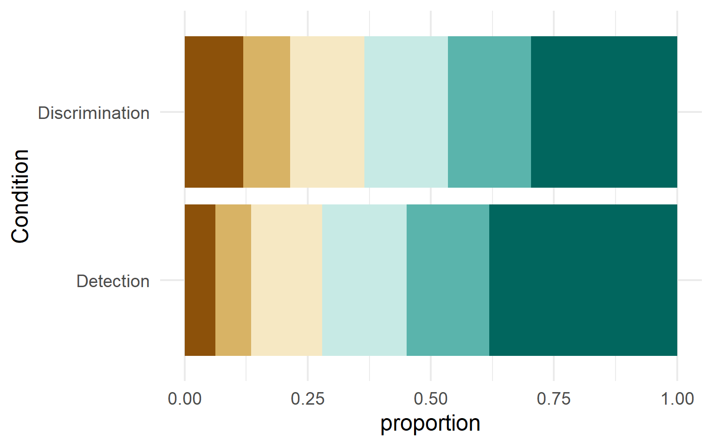
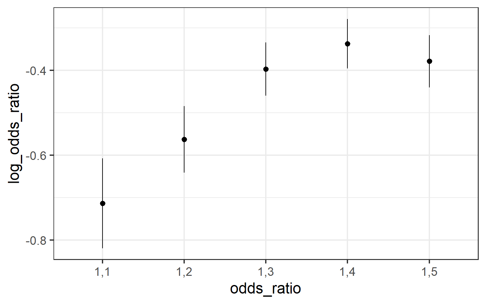
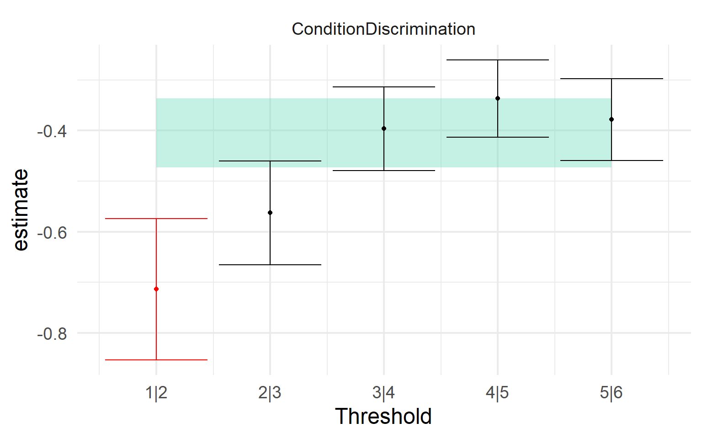
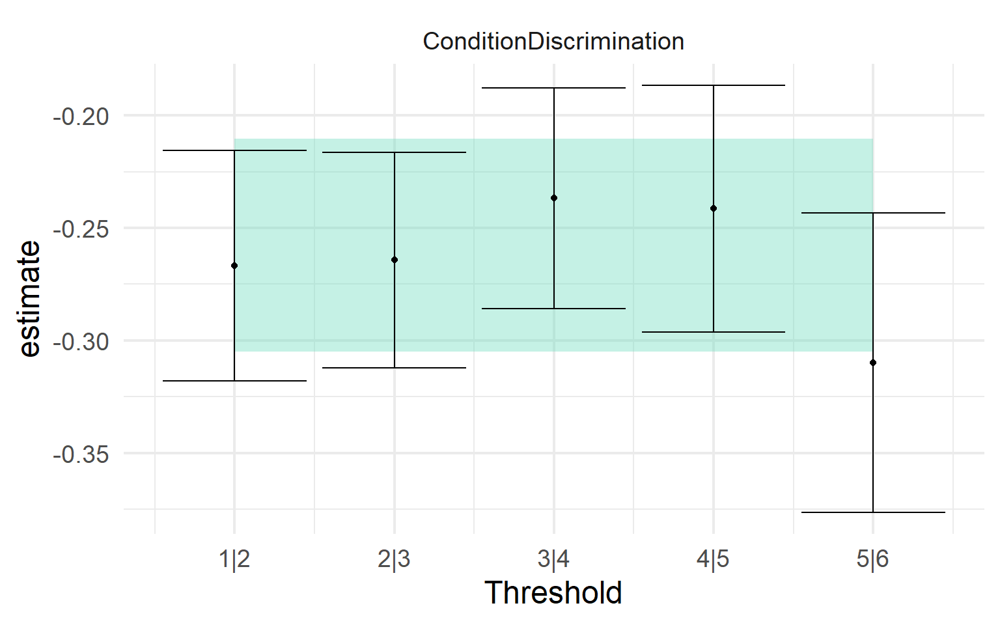

## Running Code

When you click the **Render** button a document will be generated that includes both content and the output of embedded code. You can embed code like this:

``` r
library(sostools)
library(contrastable)
library(ordinal)
library(tidyverse)
```

Here is an example of a 6-point rating scale where using a `logit` link would not serve us well, and a different choice of link function is needed.

``` r
conf_data <- 
  read_csv(r"(C:\Users\Thomas\Downloads\data_Mazor_2020.csv)") |> 
  filter(!is.nan(Confidence)) |> 
  mutate(Confidence = ordered(Confidence,levels=1:6),
         Subj_idx = factor(Subj_idx),
         Condition = factor(Condition))

head(conf_data)
```

    # A tibble: 6 × 10
      Subj_idx Stimulus Response Confidence RT_dec Conf_presses Condition   Accuracy
      <fct>       <dbl>    <dbl> <ord>       <dbl>        <dbl> <fct>          <dbl>
    1 1               0        0 6           0.883            2 Discrimina…        1
    2 1               1        1 3           0.932            1 Discrimina…        1
    3 1               1        0 2           1.33             1 Discrimina…        0
    4 1               1        0 5           0.766            2 Discrimina…        0
    5 1               1        1 6           0.766            3 Discrimina…        1
    6 1               1        1 6           0.733            3 Discrimina…        1
    # … with 2 more variables: Contrast <dbl>, Orientation <chr>

What does the data look like? If we look closely we can see that there is a higher proportion of the higher scale values. I'll plot this in two different ways.

``` r
aggregate_proportions <- 
  conf_data |> 
  group_by(Confidence, Condition) |> 
  summarize(count = n()) |> 
  group_by(Condition) |> 
  mutate(proportion = count / sum(count))

aggregate_proportions |> 
  ggplot(aes(x = Confidence, y = proportion, fill = Condition)) +
  geom_col(position=position_dodge(width=.9)) +
  theme_bw(base_size = 18)

aggregate_proportions |> 
ggplot(aes(y = Condition, x = proportion, fill=forcats::fct_rev(Confidence))) +
  geom_col() +
  scale_fill_brewer(palette = 'BrBG',
                    direction = -1)+
  theme_minimal(base_size=18) +
  theme(legend.position = 'none') 
```

<figure>

<figcaption aria-hidden="true">Proportion of scale responses for each value and condition, the bars add up to 1</figcaption>
</figure>

<figure>

<figcaption aria-hidden="true">The same proportions, but stacked to better show the high-value skew in the data</figcaption>
</figure>

What are the odds of going from one rating to the next? How do those odds change at each threshold between ratings? If we use the symmetric logit link, our cumulative odds ratios would look like the figure below.

``` r
xtable <- xtabs(~Condition + Confidence, data=conf_data)

sostools::odds_ratios(xtable) |> 
  ggplot(aes(x = odds_ratio, 
             y = log_odds_ratio, 
             ymin = log.confint.low,
             ymax = log.confint.high)) +
  geom_pointrange() +
  theme_bw(base_size = 18)
```



This doesn't look like it meets the proportional odds assumption with the logit link. As you go towards the lower end of the scale, the odds ratios decrease dramatically. This would reflect that the lower scale values are used less, and those unconfident responses are reallocated towards the higher end (which already had a lot of responses). If we fit a cumulative model of proportional odds form with the logit link, it will give us an effect estimate, but we can compare this to the results of separate logistic regressions along each threshold. This is essentially the model-fitting analogue of the manual calculation of the log odds we already found from the empirical data, notice the same results.

``` r
ord_mdl <- clm(Confidence ~ Condition,
               data = conf_data,
               link = "logit")
summary(ord_mdl)
```

    formula: Confidence ~ Condition
    data:    conf_data

     link  threshold nobs  logLik    AIC      niter max.grad cond.H 
     logit flexible  18190 -30369.89 60751.78 5(0)  1.24e-09 4.8e+01

    Coefficients:
                            Estimate Std. Error z value Pr(>|z|)    
    ConditionDiscrimination -0.40452    0.02652  -15.25   <2e-16 ***
    ---
    Signif. codes:  0 '***' 0.001 '**' 0.01 '*' 0.05 '.' 0.1 ' ' 1

    Threshold coefficients:
        Estimate Std. Error z value
    1|2 -2.52182    0.02968  -84.96
    2|3 -1.76454    0.02417  -73.00
    3|4 -0.95088    0.02098  -45.32
    4|5 -0.22819    0.01988  -11.48
    5|6  0.47200    0.02021   23.36

``` r
propodds <- test_propodds(conf_data, Confidence ~ Condition, ord_mdl,.link = 'logit')
plot_propodds(propodds) +
  theme_minimal(base_size=18) +
  theme(legend.position = 'none')
```



Clearly these do not meet the proportional odds assumption for the logit link. We can use the `cloglog` link to capture how there are more higher values than lower values. This will give us different estimates for the thresholds and the effect of Condition because the cumulative distribution function is different.

``` r
ord_mdl <- clm(Confidence ~ Condition,
               data = conf_data,
               link = "cloglog")
summary(ord_mdl)
```

    formula: Confidence ~ Condition
    data:    conf_data

     link    threshold nobs  logLik    AIC      niter max.grad cond.H 
     cloglog flexible  18190 -30387.82 60787.64 6(0)  1.37e-11 5.7e+01

    Coefficients:
                            Estimate Std. Error z value Pr(>|z|)    
    ConditionDiscrimination -0.25759    0.01834  -14.04   <2e-16 ***
    ---
    Signif. codes:  0 '***' 0.001 '**' 0.01 '*' 0.05 '.' 0.1 ' ' 1

    Threshold coefficients:
        Estimate Std. Error z value
    1|2 -2.48854    0.02666 -93.331
    2|3 -1.78424    0.02044 -87.306
    3|4 -1.07761    0.01650 -65.315
    4|5 -0.51670    0.01458 -35.436
    5|6 -0.04959    0.01361  -3.644

``` r
propodds <- test_propodds(conf_data, Confidence ~ Condition, ord_mdl,.link = 'cloglog')
plot_propodds(propodds) +
  theme_minimal(base_size=18) +
  theme(legend.position = 'none')
```



This link function fits much better. You may notice that the highest threshold is noticeably lower than all the others, but the confidence interval is still well within the prediction from the ordinal model.
