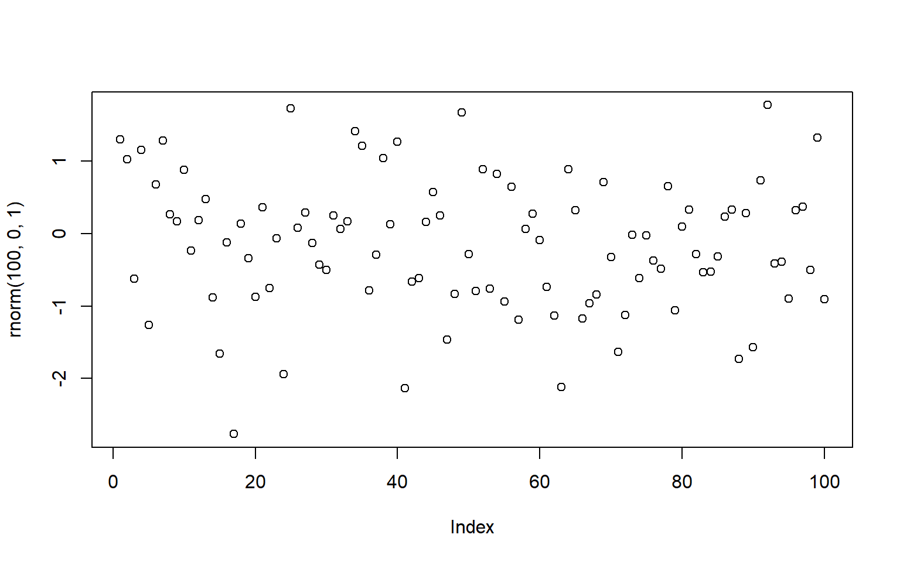











``` r
plot(rnorm(100, 0, 1))
```





``` r
a <- 1
b <- 4
c <- a + b
```

## Quarto

Quarto enables you to weave together content and executable code into a finished document. To learn more about Quarto see <https://quarto.org>.

## Running Code

When you click the **Render** button a document will be generated that includes both "content" and the output of embedded code. You can embed code like this:

``` r
1 + 1
```

    [1] 2

You can add options to executable code like this

    [1] 4

The `echo: false` option disables the printing of code (only output is displayed).
